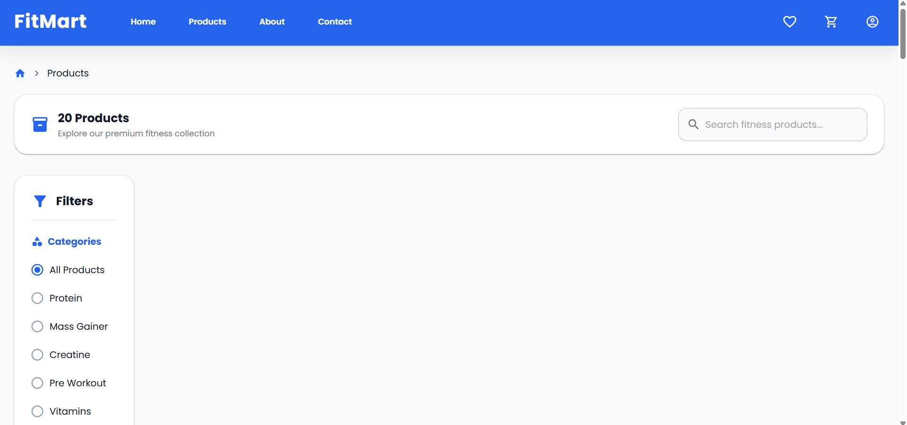
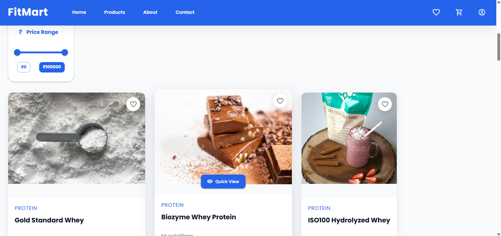
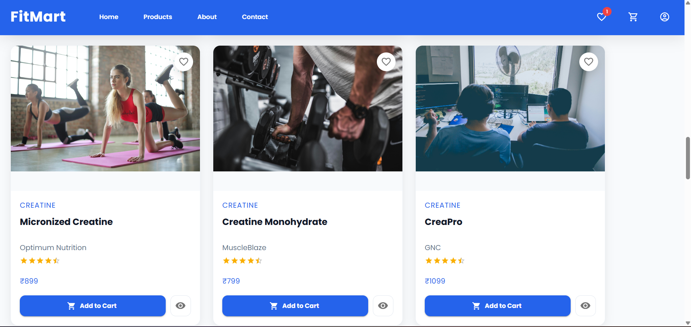
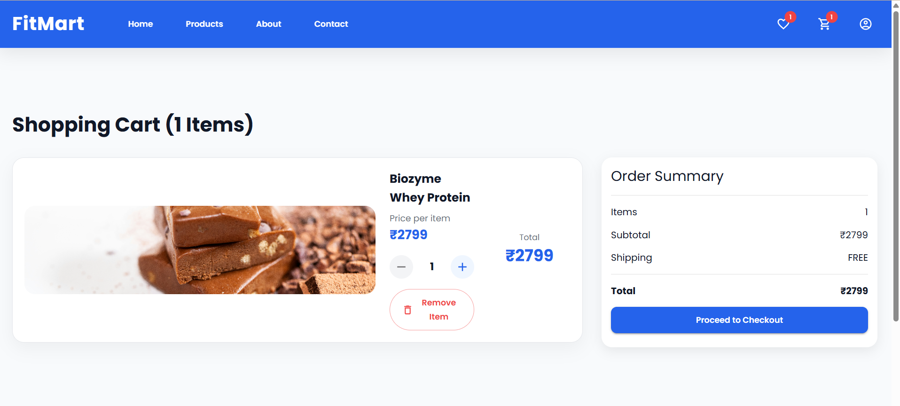
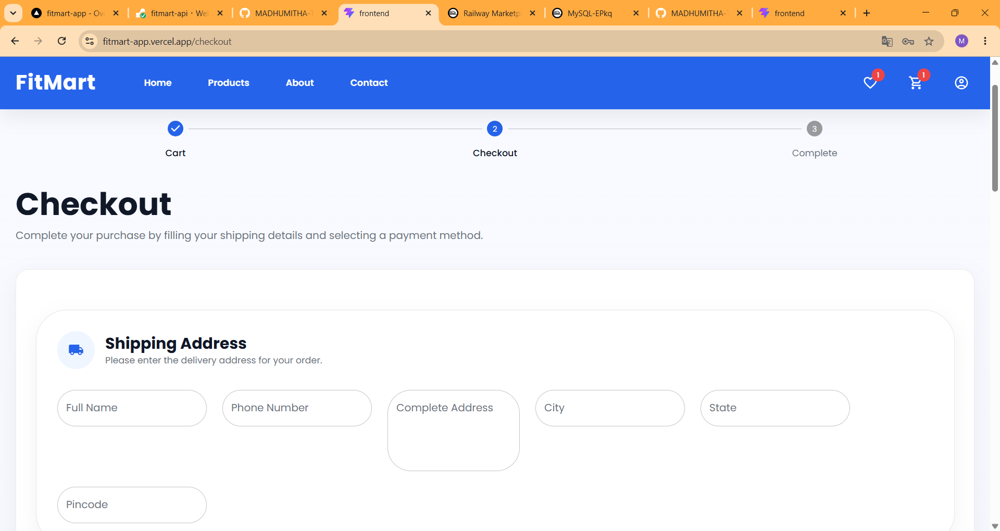
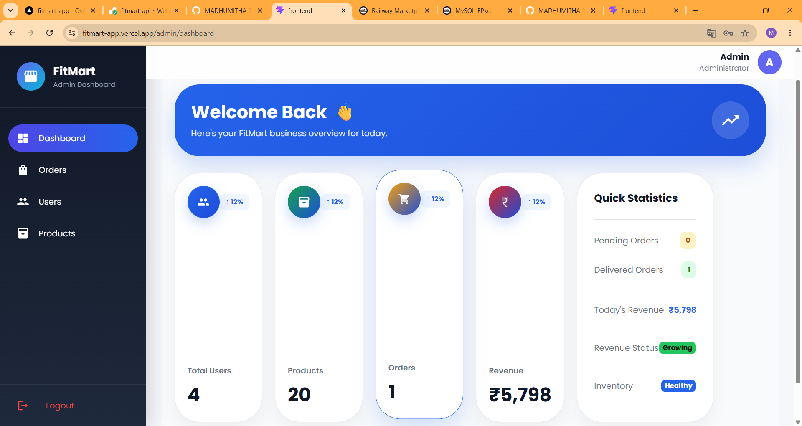

# 🏋️ FitMart - Full Stack Fitness E-Commerce Platform

## 🚀 Live Demo

🌐 Frontend:
https://fitmart-app.vercel.app/

🔗 Backend API:
https://fitmart-api.onrender.com

---

# 📌 Overview

FitMart is a full-stack fitness e-commerce application built to provide users with a seamless online shopping experience for health and fitness products.

The platform allows customers to explore fitness products, manage their cart, maintain a wishlist, place orders, and manage their profiles.

It also includes an Admin Dashboard where administrators can manage products, inventory, users, and orders.

This project demonstrates real-world full-stack development practices including:

- REST API development
- JWT based authentication
- Role-based authorization
- Database management
- Cloud deployment
- Responsive UI development

---

# ✨ Features

## 👤 User Features

### Authentication & Authorization

- User registration
- Secure login
- JWT authentication
- Role-based access control
- Protected routes
- Password encryption

---

## 🛒 Shopping Features

- Browse fitness products
- Search products
- View product details
- Add products to cart
- Update cart quantity
- Remove products from cart
- Wishlist management
- Checkout process

---

## 📦 Order Management

Users can:

- Place orders
- View order history
- Track order status
- Manage profile information

---

👨‍💼 Admin Features

Admin dashboard provides:

### Product Management
- Add products
- Update products
- Delete products
- Manage inventory

### Order Management
- View customer orders
- Update order status

### User Management
- Manage registered users
  
### Analytics Dashboard
- Product statistics
- Order statistics
- Sales overview

---
Tech Stack

## Frontend

| Technology | Purpose |
|---|---|
| React.js | Frontend framework |
| Redux Toolkit | State management |
| React Router | Navigation |
| Material UI | UI components |
| Axios | API communication |
| Formik | Form handling |
| Yup | Validation |
| Chart.js | Analytics visualization |
| Vite | Build tool |

## Backend

| Technology | Purpose |
|-|-|
| Java | Programming language |
| Spring Boot | Backend framework |
| Spring Security | Application security |
| JWT | Authentication |
| Hibernate | ORM |
| Spring Data JPA | Database operations |
| Maven | Dependency management |

## Database
| Technology | Purpose |
|-|-|
| MySQL | Data storage |

## Deployment

| Service | Usage |
|-|-|
| Vercel | Frontend hosting |
| Render | Backend hosting |
| Cloud MySQL | Database hosting |
---

🏗️ System Architecture

                User
                  |
                  |
          React.js Frontend
                  |
              Axios API
                  |
                  |
          Spring Boot Backend
                  |
    --------------------------------
    |                              |   
  Spring Security JWT REST APIs   MySQL Database

🔐 Security Implementation

FitMart implements secure authentication using Spring Security and JWT.
## Security Flow
User Login
|
|
Authentication Request
|
|
Spring Security
|
|
JWT Token Generated
|
|
Token Sent With Requests
|
|
JWT Filter Validation
|
|
Authorized Access

Implemented:
✅ JWT Authentication
✅ Password encryption
✅ Role-based authorization
✅ Protected API endpoints
✅ CORS configuration

Project Structure

FitMart
│
├── frontend
│ │
│ ├── src
│ │ ├── components
│ │ ├── pages
│ │ ├── redux
│ │ ├── services
│ │ └── utils
│ │
│ └── package.json
│
│
├── backend
│ │
│ ├── src/main/java
│ │ ├── controller
│ │ ├── service
│ │ ├── repository
│ │ ├── entity
│ │ ├── security
│ │ └── config
│ │
│ └── pom.xml
│
│
├── screenshots
│
└── README.md

Application Screenshots

##Home

## Product Listing

## Cart

## Checkout

## Admin Dashboard

Installation & Setup
## Clone Repository
``bash
git clone https://github.com/MADHUMITHA-TV/fitmart-app.git
cd fitmart

Backend Setup

Navigate to backend:
cd backend

Configure MySQL database in:
application.properties

Example:

spring.datasource.url=jdbc:mysql://localhost:3306/fitmart
spring.datasource.username=root
spring.datasource.password=password
spring.jpa.hibernate.ddl-auto=update

Frontend Setup
Navigate to frontend:
cd frontend

Install dependencies:
npm install

Create .env file:
VITE_API_BASE_URL=http://localhost:8081

Run application:
npm run dev

Frontend runs on:
http://localhost:5173

API Modules:
Authentication API
Endpoint	Method
/api/auth/register	POST
/api/auth/login	POST

Product API:
Endpoint	Method
/api/products	GET
/api/products/{id}	GET
/api/admin/products	POST
/api/admin/products/{id}	DELETE

Cart API:
Endpoint	Method
/api/cart	GET
/api/cart/add	POST
/api/cart/remove	DELETE

Order API:
Endpoint	Method
/api/orders	GET
/api/orders/create	POST

🧪 Testing Checklist
Authentication Testing
✅ Valid login
✅ Invalid password handling
✅ Unauthorized API access
✅ JWT validation

Product Testing
✅ Product listing
✅ Product search
✅ Product creation
✅ Product update
✅ Product deletion

Cart Testing
✅ Add item
✅ Update quantity
✅ Remove item
✅ Empty cart handling

Order Testing
✅ Order creation
✅ Order history
✅ Order status update

Future Enhancements:
Payment Integration:
Razorpay
Stripe
Advanced Features:
Product reviews
Ratings
Email notifications
Order tracking
Recommendation system
AI-based product suggestions:
DevOps Improvements
Docker containerization
CI/CD pipeline
Automated testing
AWS deployment

Project Highlights:

⭐ Full-stack production-style application
⭐ Secure JWT authentication
⭐ Role-based authorization
⭐ Responsive React UI
⭐ RESTful Spring Boot APIs
⭐ Cloud deployment
⭐ Real-world e-commerce workflow

Developer
Madhumitha T V
B.Tech Artificial Intelligence and Data Science

Interested in:
Software Engineering
Full Stack Development
Artificial Intelligence

Contact
LinkedIn:
https://www.linkedin.com/in/madhumitha-t-v-/

GitHub:
https://github.com/MADHUMITHA-TV

Email:
madhumithavijayan52@gmail.com

mvn spring-boot:run

Backend runs on:

http://localhost:8081
  
